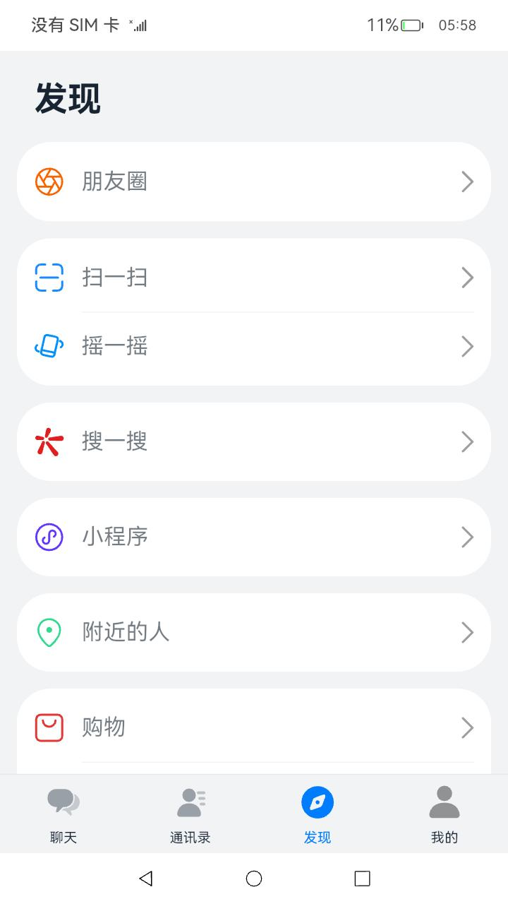

# 聊天实例应用

### 介绍

这是一个仿聊天类应用，使用了静态布局搭建了不同的页面。为了优化内存与性能体验，在部分list场景使用了懒加载。

本示例用到了 图片处理能力接口[@ohos.multimedia.image](https://gitee.com/openharmony/docs/blob/master/zh-cn/application-dev/reference/apis-image-kit/js-apis-image.md)。

文件存储管理能力接口[@ohos.fileio](https://gitee.com/openharmony/docs/blob/master/zh-cn/application-dev/reference/apis-core-file-kit/js-apis-fileio.md) 。

### 效果预览
| 主页                                    | 通讯录                                      | 发现                                     | 个人页面                                |
| ------------------------------------- | ---------------------------------------- | -------------------------------------- | ----------------------------------- |
|  |  |  |  |

使用说明

1.应用包含“聊天”、”通讯录“、”发现“、”我“四个主页面，使用Tabs组件实现模块的切换，“聊天”和“通讯录”模块使用了LazyForEach懒加载功能。

2.二级及以上页面左上角都有一个返回按钮。

3.聊天内容页面的下方输入框点击可以输入内容，表情的图标点击可以发送图片。

4.“发现”页面的“朋友圈”点击会进入“朋友圈”页面。

### 工程目录

```
features/chatlist/src/main/ets             // 列表类功能HAR共享包
|---/pages    
|   |---ChatDetailPage.ets                 // 具体的某一聊天页面            
|   |---ChatListPage.ets                   // 整体聊天页面
|---/utils
|   |---Constants.ets                      // 封装只读常量
|   |---DataFactory.ets                    // 封装对数据处理方法
|   |---FriendMomentJsonUrl.ets            // 封装朋友圈json地址
|   |---Logger.ets                         // 封装整个日志
|   |---PageConstants.ets                  // 封装页面地址只读常量
|---/view
|   |---ChatView.ets                       // 聊天列表每个单独模块
|   |---OptLayoutChatView.ets              // 可复用的列表模块
|---/viewmodel
|   |---BasicDataSource.ets                // 封装朋友列表数据方法
|   |---ChatListDataSource.ets             // 封装聊天列表数据方法
|   |---MsgBase.ets                        // 封装聊天列表对象方法
products/phone/entry/src/main/ets
|---/entryability
|   |---EntryAbility.ts                    // 封装整个模块启用，监听Ability对应的窗口等逻辑
|---/pages                                                               
|   |---/workers 
|   |   |---worker.ts                      // worker线程逻辑处理
|   |---Detail.ets                         // 聊天详情页面
|   |---DiscoverPage.ets                   // 发现页面
|   |---FriendsMomentsPage.ets             // 朋友圈页面
|   |---FriendsPage.ets                    // 通讯录页面
|   |---FullImagePage.ets                  // 点击朋友圈图片放大图
|   |---Index.ets                          // 首页
|   |---SettingPage.ets                    // 我的页面
|---resources/images                       // 放置图片，icon资源等  
|---/utils
|   |---Logger.ets                         // 封装整个日志
|---/view
|   |---CustomDialogExample.ets            // 自定义功能弹窗页面
|   |---TopBar.ets                         // 定义应用头部导航栏
```

#### 相关概念

懒加载：开发框架提供数据懒加载（LazyForEach组件）从提供的数据源中按需迭代数据，并在每次迭代过程中创建相应的组件。

多线程：开发框架提供[多线程并发能力](https://docs.openharmony.cn/pages/v5.0/zh-cn/application-dev/performance/multi_thread_capability.md/)，允许在同一时间段内同时执行多段代码，进行大量或调度点较分散的任务开发和处理。

### 具体实现

1、定义要跳转子页面：在products/phone/entry/pages/index.ets中通过TabContent()
定义要跳转的子页面，[源码参考](./products/phone/entry/src/main/ets/pages/Index.ets)   
例如：跳转通讯录界面：TabContent() {
FriendsPage() }。  
2、使用LazyForEach数据懒加载对“聊天”和“通讯录”模块进行数据渲染：当LazyForEach在滚动容器中使用，框架会根据滚动容器可视区域按需创建组件，当组件划出可视区域外时，框架会进行组件销毁回收以降低内存占用，[源码参考](./products/phone/entry/src/main/ets/pages/FriendsPage.ets )。  
3、页面之间的跳转通过在config.json中先配置好相关路由，并通过router.push()进行页面跳转,例如：跳转到搜索页面router.push({
url: 'pages/SearchPage' })。  
4、页面组件加载前，通过fileio.readSync以同步的方式读取数据，在EntryAbility生命周期中获取对应的Want信息。

### AOT开启方式

1. 打开Chat工程，完成同步，并将工程编译模式调整为 release。
2. 指定热点ap文件储存路径，并关闭混淆功能。即，在模块级 build-profile.json5 文件中，配置如下：

   ```ts
   {
     "apiType": "stageMode",
     "buildOption": {
       "arkOptions": {
         "apPath": "./modules.ap"
       }
     },
     "buildOptionSet": [
       {
         "name": "release",
         "arkOptions": {
           "obfuscation": {
             "ruleOptions": {
               "enable": false
             }
           }
         }
       }
     ],
     ...
   }
   ```
3. 从设备端采集热点ap文件：
   - 通过命令行开启设备ap文件开关。
     ```shell
     hdc shell param set ark.profile true
     ```
   - 将应用按步骤1中release模式打包出hap并安装到设备上，在需要优化的场景进行操作，记录高频操作后，通过命令行导出ap文件。
     ```shell
     hdc file recv /data/local/ark-profile/100/{bundleName}/modules.ap {apPath}
     ```
4. 将步骤3中获取到的ap文件，放入步骤2中指定的apPath路径。
5. 按照步骤1中的release编译模式进行编译，并安装到设备，等待设备端侧AOT编译优化完成后，应用运行性能即可得到相应的提升。

> **AOT前置约束说明**
> - 仅支持API10及以上版本Stage模型的ArkTS工程
> - 目前仅HAP和HSP支持该功能
> - IDE需要4.0.1.400及以上版本
> - Node.js需要14.19.1及以上版本
> - SDK建议升级到OpenHarmony 4.0 beta2（4.0.9.2）及以上版本

### 相关权限

不涉及。

### 依赖

不涉及。

### 约束与限制

1.本示例已适配API version 12版本SDK，SDK版本号(5.0.0.32),镜像版本号(5.0.0.32)。

2.本示例需要使用DevEco Studio 版本号(4.1.3.700)版本才可编译运行。

### 下载

如需单独下载本工程，执行如下命令：

```
git init
git config core.sparsecheckout true
echo code/Solutions/IM/Chat/ > .git/info/sparse-checkout
git remote add origin https://gitee.com/openharmony/applications_app_samples.git
git pull origin master
```